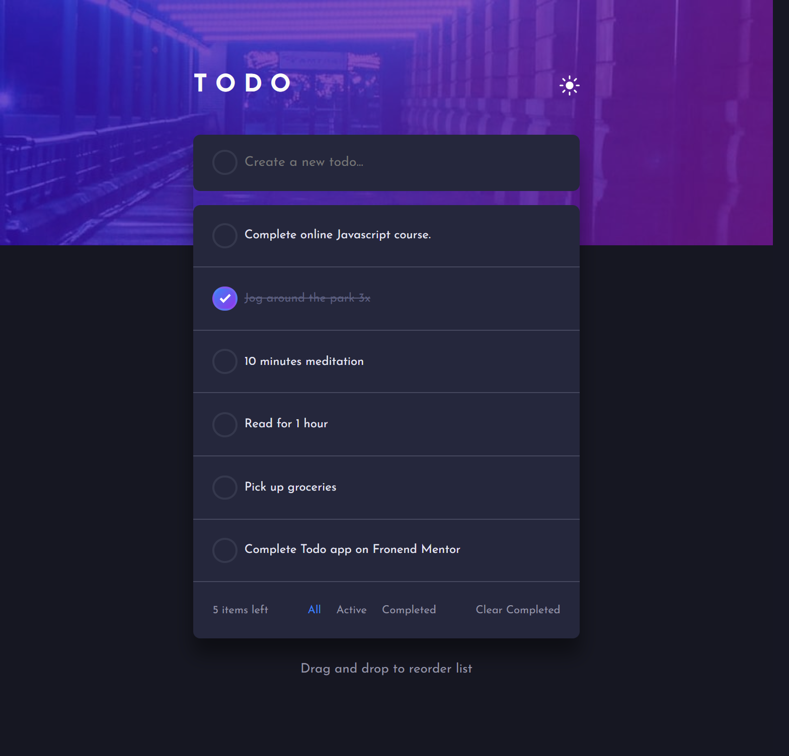

Frontend Mentor - Todo app solution

This is a solution to the Todo app challenge on Frontend Mentor. Frontend Mentor challenges help you improve your coding skills by building realistic projects.

Table of contents

Overview

The challenge

Screenshot

Links

My process

Built with

What I learned

Continued development

Useful resources

Author

Acknowledgments

Overview
The challenge

Users should be able to:

View the optimal layout for the app depending on their device's screen size

See hover states for all interactive elements on the page

Add new todos to the list

Mark todos as complete

Delete todos from the list

Filter by all/active/complete todos

Clear all completed todos

Toggle light and dark mode

Bonus: Drag and drop to reorder items on the list

Screenshot

Links

Solution URL: (https://github.com/Fabiha517/To-Do-App.git)

Live Site URL: (https://fabiha517.github.io/To-Do-App/)

My process
Built with

Semantic HTML5 markup

CSS custom properties

Flexbox

CSS Grid

Mobile-first workflow

Vanilla JavaScript (ES6+)

What I learned

While working on this project, I reinforced my understanding of DOM manipulation with JavaScript, especially for:

Dynamically creating and appending tasks

Managing task states (active, completed, deleted)

Using classList for toggling themes and task styles

Implementing drag and drop functionality

Example:

task.addEventListener('dragstart', () => {
  task.classList.add('dragging');
});

This project also helped me understand how to structure code for better readability and maintainability.

Continued development

In future projects, I’d like to:

Improve drag-and-drop handling for smoother user experience

Store todos in localStorage so they persist after refresh

Explore frameworks like React to handle state management more efficiently

Author

Frontend Mentor - @Fabiha517

